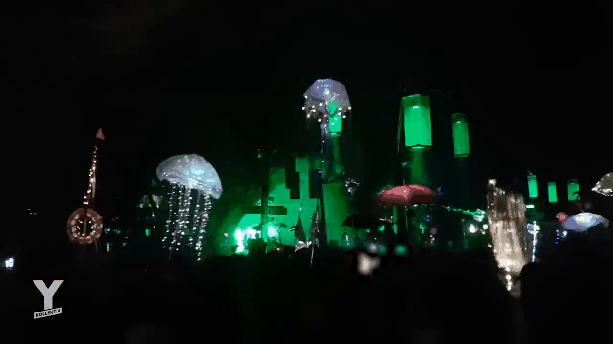
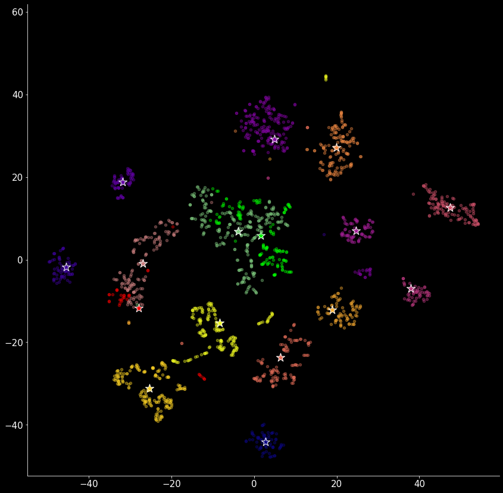

# Totem-Lights

Welcome to Totem-Lights, a repository dedicated to the exploration and analysis of festival totems. Our primary focus is on the object detection of these totems, utilizing bounding boxes (bboxes) for the visualization of different totems.

This project aims to understand the evolutionary surroundings of totem organisms and their movements in the state space. We achieve this by using t-SNE (t-Distributed Stochastic Neighbor Embedding) on the image sequences extracted from the totem videos.

The majority of our observations and data collection occur during the night, allowing us to capture the mesmerizing lights emitted by these totems.

## Data Sources

Our data is sourced from a variety of platforms, including YouTube videos and personal videos contributed by friends and family. Each totem has a detailed description of its original video, which can be found in a later section of this document.

Example - Short video clip:

### Data Collection and Preprocessing

The video material was collected and uploaded to the Roboflow platform for annotation (https://app.roboflow.com/mike-hemberger-ukw3b/totem-tracker/12). The primary method of annotation was bounding boxes (bboxes), but in some cases, segmentation masks were also used.

After manual annotation, the dataset was exported to disk. We then read in the image and its annotations, limiting ourselves to bboxes (bboxes extracted from segmentation masks). This process allowed us to cut out the totem for each video image frame over time.

Example of totems:

### Feature Extraction and Analysis

The cutouts were resized to 224x224 pixels, and feature extraction was performed on the images using the Vision Transformer (ViT) model from Hugging Face Transformers. The extracted feature vectors were then subjected to t-Distributed Stochastic Neighbor Embedding (t-SNE) for analysis. The goal of this process is to identify distinct "states" of the totems' light-emitting activity over time. While time is implicitly retained as an axis, it is replaced with a 2D t-SNE axis to better visualize the evolution of these states.

## Notebook and Python Files

Below is a checklist of the notebooks and Python files used in this project, along with a brief description of each:

**1.**`video-ETL.ipynb`: Description of what this notebook does.
**2.**`prototype_v1-video-feature-extraction.ipynb`: Description of what this notebook does.
**3.**`totem_utils.py`: Description of what this Python file does.

## Video Overview

The following table provides a detailed description of the original video for each totem:

| id | video_filepath                                                                    | fps-fps_extract | renamed_filepath | label-id-name | txt_filepath                                                            | pixels        | images_from_video_filepath                                      | has_bbox | dataset_version | total-totems        | totems-annotated | pixels-extracted      | SR-ESGAN | sr-pixels |  |  |
| -- | --------------------------------------------------------------------------------- | --------------- | ---------------- | ------------- | ----------------------------------------------------------------------- | ------------- | --------------------------------------------------------------- | -------- | --------------- | ------------------- | ---------------- | --------------------- | -------- | --------- | - | - |
| 3  | data/videos/fusion-2014-freemake-cut.mp4                                          | 25?-25          | -                | 1             | data/videos/fusion-2014                                                 | 1280 × 720 | data/videos/fusion-2014                                         | 1        | ?               | ? totem name=1=ID?! | 1                | redo>rezied thus far  | 1        |           |  |  |
| 1  | data/videos/fusion-yt-8sec.mp4                                                    | 25?-25          |                  | 0             | data/videos/fusion-yt-8sec                                              | 1280 × 720 |                                                                 |          |                 |                     |                  |                       |          |           |  |  |
|    |                                                                                   | 30-25           |                  |               |                                                                         |               |                                                                 |          |                 |                     |                  |                       |          |           |  |  |
|    |                                                                                   |                 |                  |               |                                                                         |               |                                                                 |          |                 |                     |                  |                       |          |           |  |  |
| 6  | data/videos/PXL_20230701_001535797TS/PXL_20230701_001535797TS.mp4                 | 30-30           | ....frames/      |               |                                                                         | 1080x1920     | data/videos/PXL_20230701_001535797TS/images/annotated-roboflow/ |          | v7              | 2                   | 2                | roughly 407 × 742 | 0        |           |  |  |
| 7  | data/videos/PXL_20230701_001535797TS/PXL_20230701_001535797TS.mp4                 |                 |                  |               | data/videos/PXL_20230701_001535797TS/images/annotated-roboflow/         | 1080x1920     | data/videos/PXL_20230701_001535797TS/images/annotated-roboflow/ |          | v7              | 2                   | 2                | roughly 726 × 597 | 0        | XxX       |  |  |
|    |                                                                                   |                 |                  |               |                                                                         |               |                                                                 |          |                 |                     |                  |                       |          |           |  |  |
|    |                                                                                   |                 |                  |               |                                                                         |               |                                                                 |          |                 |                     |                  |                       |          |           |  |  |
| 14 | data/videos/VID-20230703-WA0028_39-42sec-cut/VID-20230703-WA0028_39-42sec-cut.mp4 | 25              |                  |               | data/videos/VID-20230703-WA0028_39-42sec-cut/images/annotated-roboflow/ |               | data/videos/PXL_20230701_001535797TS/images/annotated-roboflow/ |          |                 |                     |                  |                       |          |           |  |  |

# To-Do List

**-** Train a neural network for totem detection so that new videos can be automatically annotated.
**-** Check performance and test on an un-annotated video.

# Prototype Totem v1-2

We have developed a physical prototype of a totem using an umbrella and LEDs clipped to its mantle, mimicking a bioluminescent jellyfish. We have analyzed the LED activity patterns over time and applied t-SNE for state identification, which has proven to be effective.

## Identifying LED States at Home

Using the methodologies described above, we were able to identify distinct LED states at home using a totem prototype. Here's a brief overview of how we achieved this:

**1.****Data Collection******: We collected video data from the totem prototype in various lighting conditions and times of day.
**2.****Data Processing******: The video data was processed and annotated using the Roboflow platform, similar to the process described in the Data Collection and Processing section.
**3.****Feature Extraction and Analysis******: We extracted features from the processed images using the ViT model and analyzed the feature vectors using t-SNE. This allowed us to identify distinct LED states over time.

